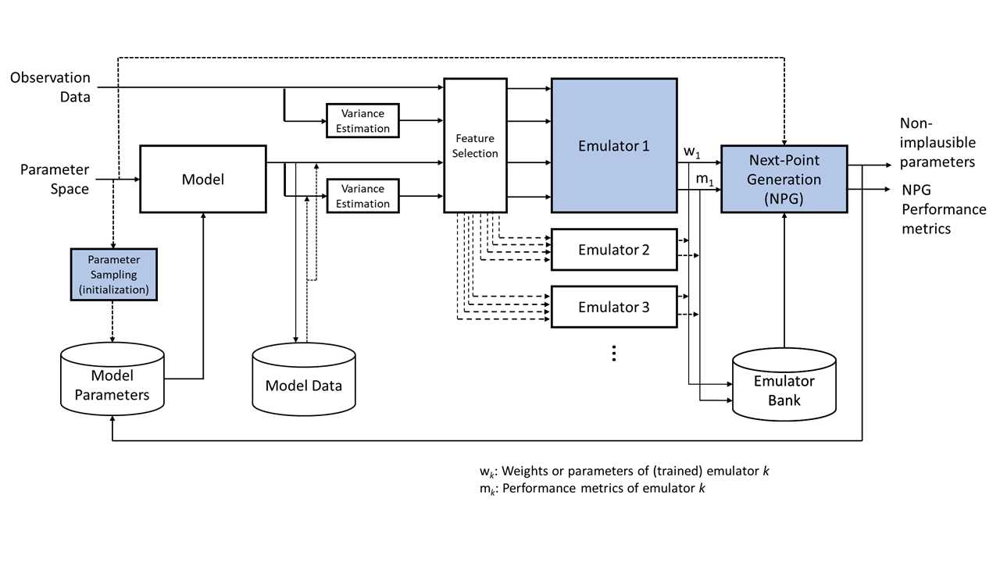
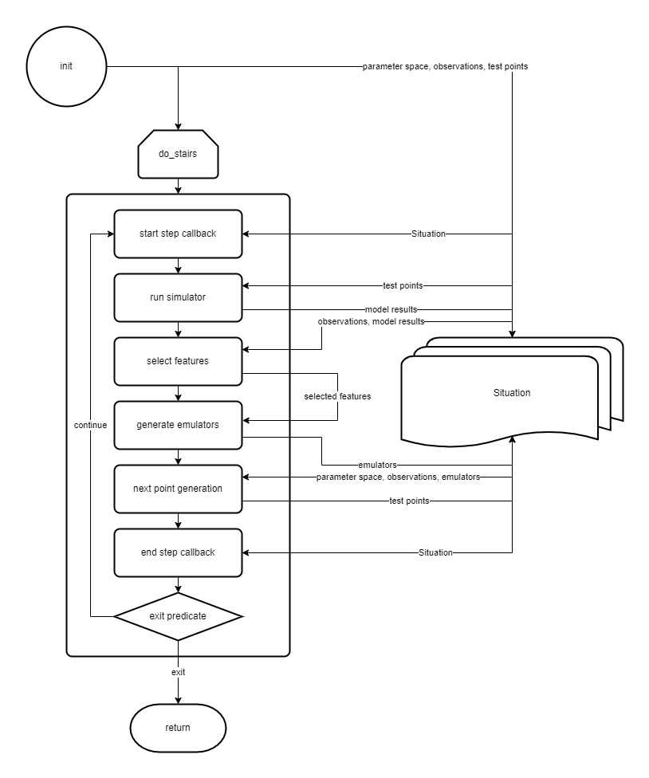

<!-- START doctoc generated TOC please keep comment here to allow auto update -->
<!-- DON'T EDIT THIS SECTION, INSTEAD RE-RUN doctoc TO UPDATE -->
**Table of Contents**

- [Architecture Proposal](#architecture-proposal)
  - [Overview](#overview)
  - [Notes](#notes)
  - [Proposals](#proposals)
  - [Questions](#questions)
  - [Pseudocode](#pseudocode)
  - [In-Memory Data Structures](#in-memory-data-structures)
    - [Parameter Space](#parameter-space)
    - [Observations / Ground Truth](#observations--ground-truth)
    - [Sample Points](#sample-points)
    - [Simulator Results](#simulator-results)
    - [Emulator Bank](#emulator-bank)
    - [Situation Object](#situation-object)
    - [Recipe Object](#recipe-object)

<!-- END doctoc generated TOC please keep comment here to allow auto update -->

# Architecture Proposal



[https://app.diagrams.net]

## Overview

Given some _observational data_, a _model_ (AKA simulator) which includes fixed configuration data opaque to the history matching package (HMP), and an initial _parameter space_ defined by a set of parameters and their minima and maxima, an iteration of the history matching algorithm is as follows:

1. **Next-Point Generation (NPG)**: A set of test points in the non-implausible parameter space are chosen. In subsequent iterations, the non-implausible space is constrained by the results of prior iterations of the algorithm. The next point generation algorithm can be user selected/defined.<br>
- Inputs: 1) the original unconstrained parameter space and 2) the comprehensive set of all emulators generated in previous iterations.<br>
- Outputs: 1) performance metrics, e.g., fraction of remaining non-implausible space and 2) a proposed set of test points in parameter space
2. **Proceed/Exit Determination** (¿PrED-icate?): The algorithm may halt at this point given either a) determination that a sufficient fraction of the original parameter space has been rejected as implausible or b) the non-implausible parameter space is no longer being reduced.<br>
- Inputs: performance metrics
- Outputs: boolean go/no-go determination
3. **Model Execution**: The model is run one or more times at each sample point in parameter space.<br>
- Inputs: 1) the proposed set of test points in parameter space from the NPG step and 2) "opaque" model specific configuration<br>
- Outputs: rectangular dataframe with one column each for iteration, sample point parameter values (simulator inputs), and feature values (simulator outputs)
4. **Feature Selection**: One or more features (outputs) of the model, appropriate to the current iteration, are chosen to be used for generating new emulators.<br>
- Inputs: 1) current iteration and 2) model data for tested points in parameter space<br>
- Outputs: one or more features to be used for generating new emulators
5. **Emulator Generation**:  Create emulators, informed by the feature selection and known model outputs, intended to predict model output at points in parameter space which have not been explicitly tested with the model.<br>
- Inputs: 1) Observation data and 2) model data for tested points in parameter space<br>
- Outputs: one or more emulators

## Notes

- _observation data_ shall be in a rectangular dataframe with a column per feature and row per observation.
- parameters in the _parameter space_ will be scalar values, initially with minimums and maximums to bound their possible values. These can be specified with a parameter name (key), minimum, and maximum.
- _configuration data_ for the simulator (model) will be in a format specific to the user and model in question. This format will mostly be opaque to HMP with the exception of the particular parameters being used for calibration which will be a set of key:value pairs specifying the parameter name and current scalar value.
- _model execution output_ shall be in a rectangular dataframe with a column for iteration, a column each for input parameter value, and a column each for output feature value and a row per model run.
- **_TBD:_** state (de)serialization for branching and restart. This is a significant, if not required, feature.

## Proposals

- Points in parameter space collected in the Model Parameters database are tagged with iteration on which they were selected. Among other things, this would be useful for charting progress over a range of iterations.
- Emulators in the Emulator Bank are tagged with the iteration in which they were generated. The NPG might use this information to prioritize earlier or later emulators.
- The Emulator Bank should include user defined properties which may be used by the NPG to choose the order in which emulators are used to evaluate potential test points in parameters space, e.g., more discriminating evaluators may be used to evaluate test points before continuing on to additional emulators.
- HMP configuration will include a user specific `sim_config` entry. The schema and interpretation of this entry is up to the user and the user's code. One user option would be to keep all required simulation data, in memory, in the `sim_config` and read by the adapter in the Model Execution step to configure the user model (e.g., basic *sim scenario). Another user option would be to keep metadata, such as the path to the directory containing required simulation data, in the `sim_config` and the adapter in the Model Execution step would point the model to files in that directory (e.g., EMOD scenario).
- <strike>Similarly, outputs from the Model Execution step would be opaque to HMP step and may include an in memory representation of model outputs, if sufficiently compact, (*sim scenario?) or metadata about the location of model outputs on disk (EMOD scenario?).</strike> See **Notes** above.
- The Feature Selection/Emulator Generation step requires user specific code, consistent with the output from the Model Execution step, to access and assess model outputs for feature selection and extract relevant data for emulator generation.

## Questions

- ¿Do emulators require _only_ knowledge of the parameter values at a given point in parameter space or could they also need access to the fixed, model specific parameters being used to drive the simulator/model?<br>A: Emulators may need access to hyperparameters (ratio of training to test data, etc.).
- ¿Are all parameters in a continuous space between their minimum and maximum or is it possible/desirable to have parameters which select from a set of quantized values?<br>A: There may be quantization, e.g., initial infections. This can be handled by the simulator wrapper. Q: Should this be reflected in the parameters recorded in the results database, e.g., sample point initial infections = 5.6, results db initial infections = 6? This would correctly reflect the parameters used by the simulation but would not exactly match the sample points in parameter space selected for simulation.

## Pseudocode

```python

param_space = {
    "param1": {"min": min1, "max": max1, "scale": "linear", "desc": "transmission factor"},
    "param2": {"min": min2, "max": max2, "scale": "log", "desc": "parameter description"},
    "param3": {"values": [ 0, 1, 2, 3, 5, 8, 13, 21, 34, 55 ], "scale": "explicit", "desc": "description" }
    }


class Config:
    pass

config = Config()
config.max_iterations = 100     # Example, at most 100 iterations
config.reps_per_point = 10      # Example, run simulator 10x (different PRNG seeds?) at each sample point

# Templated/consistent configuration for the simulator ("real model")
config.sim_config = Config()
config.sim_config.num_people = 1000     # Example, population size of 1K
config.sim_config.initial_infs = 10     # Example, 10 initial infections

observational_data = {} # Dictionary is a placeholder, might select SQLite or something more formal
model_results_db = {}   # Dictionary is a placeholder, might select SQLite or something more formal
emulator_bank = {}      # Dictionary is a placeholder, actual datastructure TBD

for iteration in range(config.max_iterations):

    start_iteration_callback(iteration)

    # test_points is a list of points in parameter space where a
    # sample point is a dictionary of parameter:value pairs, one for each parameter in the param_space dictionary
    metrics, sample_points = generate_sample_points(iteration, param_space, emulator_bank, config)

    # exit (early) if results are satisfactory or progress has plateaued
    if exit_predicate(iteration, metrics, config):
        break

    # results would be a list of simulator results, paired with the corresponding point from test_points
    results = run_simulators(iteration, test_points, config)

    # add additional results to model results database
    merge_results(results, model_results_db, config)

    # determine features for emulator generation
    selected_features = select_features(iteration, model_results_db, config)

    # With full set of results, update emulator bank
    emulators = generate_emulators(iteration, selected_features, observational_data, model_results_db, emulator_bank, config)

    # add new emulators to emulator bank
    deposit_emulators(emulators, emulator_bank, config)

    end_iteration_callback(iteration)

    return

def run_simulators(iteration, test_points, config):

    results = []
    for point in test_points:
        for replicate in range(config.reps_per_point):
            # configure model for execution with fixed data + sample point parameter values + replicate informed data (e.g., PRNG seed)
            configure_sim()
            result = exec_simulator()
            results.append( (point, result) )

    return results

def generate_emulators(iteration, selected_features, model_results_db, emulator_bank, config):

    emulators = []
    for feature in selected_features:
        emulators.append( generate_emulator(feature) )

    return emulators
```

## In-Memory Data Structures

### Parameter Space

(Pandas DataFrame)

|"parameter"<br>(string)|"minimum"<br>(float)|"maximum"<br>(float)|
|:-:|:-:|:-:|
|_\<parameter<sub>1</sub>\>_|<min_value>|<max_value>|
|_\<parameter<sub>2</sub>\>_|<min_value>|<max_value>|
|⋮|⋮|⋮|
|_\<parameter<sub>N</sub>\>_|<min_value>|<max_value>|

### Observations / Ground Truth

(Pandas DataFrame)

|"features"<br>(string)|"means"<br>(float)|"variances"<br>(float)|
|:-:|:-:|:-:|
|_\<feature<sub>1</sub>\>_|mean<sub>1</sub>|variance<sub>1</sub>|
|_\<feature<sub>2</sub>\>_|mean<sub>2</sub>|variance<sub>2</sub>|
|⋮|⋮|⋮|
|_\<feature<sub>N</sub>\>_|mean<sub>N</sub>|variance<sub>N</sub>|


### Sample Points

(Pandas DataFrame)

|"iteration"<br>(integer)|_parameter1_<br>(float)|_parameter2_<br>(float)|...|_parameterN_<br>(float)|
|:---------:|:----------:|:----------:|:-:|:----------:|
|_iteration<sub>i</sub>_|value<sub>p1,i</sub>|value<sub>p2,i</sub>|...|value<sub>pN,i</sub>|

### Simulator Results

(Pandas DataFrame)

|"replicate"<br>(integer)|_parameter1_<br>(float)|_parameter2_<br>(float)|...|_parameterN_<br>(float)|_feature1_<br>(float)|_feature2_<br>(float)|...|_featureM_<br>(float)|
|:-:|:-:|:-:|:-:|:-:|:-:|:-:|:-:|:-:|
|0|value<sub>p1,0</sub>|value<sub>p2,0</sub>|...|value<sub>pN,0</sub>|value<sub>f1,0</sub>|value<sub>f2,0</sub>|...|value<sub>fM,0</sub>|
|1|value<sub>p1,0</sub>|value<sub>p2,0</sub>|...|value<sub>pN,0</sub>|value<sub>f1,1</sub>|value<sub>f2,1</sub>|...|value<sub>fM,1</sub>|
|⋮|⋮|⋮|...|⋮|⋮|⋮|...|⋮|
|R|value<sub>p1,0</sub>|value<sub>p2,0</sub>|...|value<sub>pN,0</sub>|value<sub>f1,R</sub>|value<sub>f2,R</sub>|...|value<sub>fM,R</sub>|
|0|value<sub>p1,1</sub>|value<sub>p2,1</sub>|...|value<sub>pN,1</sub>|value<sub>f1,0</sub>|value<sub>f2,0</sub>|...|value<sub>fM,0</sub>|
|1|value<sub>p1,1</sub>|value<sub>p2,1</sub>|...|value<sub>pN,1</sub>|value<sub>f1,1</sub>|value<sub>f2,1</sub>|...|value<sub>fM,1</sub>|
|⋮|⋮|⋮|...|⋮|⋮|⋮|...|⋮|
|R|value<sub>p1,1</sub>|value<sub>p2,1</sub>|...|value<sub>pN,1</sub>|value<sub>f1,R</sub>|value<sub>f2,R</sub>|...|value<sub>fM,R</sub>|

- _parameter1_ ... _parameterN_ represent the actual names of these parameters, e.g. "beta", "gamma", etc.
- _feature1_ ... _featureM_ represent the actual names of these features, e.g., "final_prevalence", "total_infections", etc.

### Emulator Bank

(dictionary[int, dictionary[string, emulator]])

```python
{
    0: {
        "<feature00>": emulator,
        "<feature01>": emulator,
        "...": ___,
        "<feature0N>": emulator
        },
    1: {
        "<feature10>": emulator,
        "<feature11>": emulator,
        "...": ___,
        "<feature1N>": emulator
        },
    I: {
        "<featureI0>": emulator,
        "<featureI1>": emulator,
        "...": ___,
        "<featureIN>": emulator
        },
}
```

### Situation Object

_Note:_ This is a lighthearted attempt to name something other than `State` which is accurate, but not very descriptive and used in many projects. [Reference](https://en.wikipedia.org/wiki/Michael_Sorrentino)

This object contains all the current information about the current _state_ of the calibration process (¿What's the situation?)

```python
class Situation:

    # Situation (a synonym for state or status) represents the information for an iteration
    # of a history matching pass. Information below is listed roughly in the order it is
    # needed/produced during the loop.

    iteration           # integer >= 0
    parameter_space     # see Parameter Space above in "In-Memory Data Structures" (input/read only)
    sample_points       # see Sample Points above (input and output, R/W)
    simulator_results   # see Simulator Results above (input and output, R/W)
    observations        # see Observations above (input/read only)
    emulator_bank       # see Emulator Bank above (input and output, R/W)

    situation.save(filename) -> None        # write all current data to an [ASDF file](https://asdf.readthedocs.io/en/stable/)
    Situation.read(filename) -> Situation   # create a Situation object populated with data from the given ASDF file

```

### Recipe Object

_Note:_ "Recipe" is chosen as a synonym for "template".

```python
class Recipe:

    # Recipe represents the pattern or template of a history matching pass.
    # Each step has a default (sometime "no action") and can be overridden by a
    # user to customize the process either overall or on a per-iteration basis.

    start_step_callback             # generic callback marking the start of a pass
    run_simulators                  # required override for calling the user simulator with the given point(s) in parameter space
    select_features                 # function to select features to be passed to `generate_emulators` on this pass
                                    # default is to return _all_ features
    generate_emulators              # function to loop over selected features and call generate_emulator_for_feature on each one
                                    # default is to call `generate_emulator_for_feature` on each selected feature
    generate_emulator_for_feature   # function to generate an emulator for a given feature
    generate_next_sample_points     # function to consider parameter space, ground truth observations, and existing emulators to determine next point(s)
                                    # in parameter space for consideration
    end_step_callback               # generic callback marking the end of a pass
    exit_predicate                  # function to determine if conditions warrant exiting the history matching loop
                                    # default function is to compare the current iteration against config.max_iteration _and_
                                    # current non-implausible space to non-implausible target
                                    # returns `True` _to exit_ the history matching loop (i.e., `False` == continue, do not exit)

    # The defaults below exist so users can wrap them, e.g., inspect before or after execution,
    # filter the results, e.g., apply additional conditions on emulator quality or proposed next
    # points in parameter space, or extend without duplicating code, e.g., use `default_exit_predicate`
    # to check iteration and remaining non-implausible parameter space _in addition_ to any custom
    # checks.

    default_feature_selection       # return _all_ features
    default_emulator_generator      # call `generate_emulator_for_feature` on each selected feature
    default_next_point_generator    # TODO - TBD
    default_exit_predicate          # check iteration and remaining non-implausible parameter space

```
