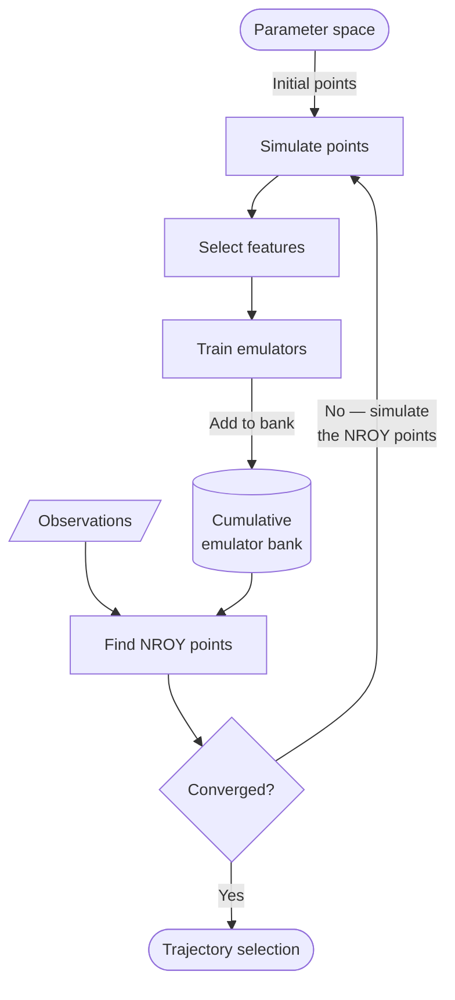

# Overview

History matching is an iterative calibration technique that progressively rules out regions of parameter space that are *implausible* — i.e., where simulated outputs are inconsistent with observations. Rather than finding a single "best fit," it identifies the set of all parameter combinations that could plausibly have produced the observed data.

## How it works

Each iteration of the algorithm:

1. **Sample** points from the current non-implausible parameter space
2. **Simulate** the model at each sample point
3. **Select features** — choose which model outputs to emulate (ranked by mean-squared z-score, or specified manually)
4. **Train emulators** — build fast statistical surrogates (Bayes linear by default; Gaussian Process Regression and others available) of the simulation
5. **Find non-implausible points** — generate candidate points and keep those consistent with the observations across *all* emulators trained so far (found via LHS or ray sampling); these seed the next iteration

The set of parameters that survive this filtering — the **NROY** set, short for *Not Ruled Out Yet* — shrinks with each iteration, converging on the region of parameter space consistent with the observations.



Each step is detailed in the list above. Two things the diagram makes explicit: candidate points are tested against the **entire emulator bank accumulated over all waves** (not just the latest), and the **NROY points found each wave become the next wave's simulation inputs**. On convergence you keep that bank plus a sample of points inside the final NROY region — from which [trajectory selection](tutorials/07_trajectory_selection.ipynb) realizes concrete `(θ, seed)` pairs — where `θ` is the parameter vector — via a Bayesian method such as sampling importance resampling on a likelihood.

## Key features

- **Single-constructor API**: Configure an entire workflow in one `HistoryMatching(...)` call
- **Interactive engine**: Step-by-step control with `step()` / `commit_step()` / `revert_step()`, or fully automated execution with `run()`
- **Multiple emulators**: Bayes linear (the default — nearly GPR-quality at a fraction of the cost), linear, GLM, and Gaussian Process Regression (GPflow-based with ARD kernels)
- **Pluggable strategies**: Swap sampling (LHS, grid, random), feature selection (automatic by mean-squared z-score, or manual), and emulator types at any point
- **Domain objects**: `ParameterSpace`, `ObservationData`, `EmulatorBank`, and `IterationResult` for clean data management
- **Checkpoint/resume**: Save and restore engine state for long-running workflows

## When to use history matching

History matching is well-suited for:

- **Expensive simulations** where each run takes minutes to hours
- **Multiple uncertain parameters** (2-20+ dimensions)
- **Multiple output features** to match against observations
- **Uncertainty quantification** — you want the set of plausible parameters, not just a point estimate
- **Iterative refinement** — you want to progressively learn which regions of parameter space are viable

It complements other calibration approaches like MCMC (which finds posterior distributions) and optimization (which finds point estimates).

## Architecture

```
HistoryMatching                 # Configure and execute the workflow
    ├── ParameterSpace          # Parameter bounds
    ├── ObservationData         # Target observations (mean, std)
    ├── SamplingStrategy        # How to generate samples (LHS, grid, random)
    ├── FeatureSelectionStrategy # Which outputs to emulate (auto, manual)
    ├── EmulatorFactory         # Which emulator to use (bayes_linear, linear, glm, gpr)
    ├── step()                  # Run one iteration
    ├── commit_step()           # Accept the iteration
    ├── revert_step()           # Reject and retry
    └── run()                   # Fully automated multi-iteration
            │
            ▼
IterationResult                 # Immutable results per iteration
    ├── samples                 # Parameter samples used
    ├── simulation_results      # Model outputs
    ├── emulators               # Trained emulators
    └── nroy_fraction           # Fresh-LHS acceptance rate (convergence diagnostic)
```
